```{r}
library(tidyverse)
library(knitr)
library(here)
library(kableExtra)
library(gt)

```

## How many popcorn kernels are in the jar? {.center background-color="#CC79A7"}

(keep your guess to yourself!)


# Introduction to the Course

**Week 1**

## Agenda

-   Introductions
-   Syllabus
-   Introduce `R`

**Learning Objectives**

-   Understand the course requirements
-   Get you excited about `R`!

## About me {.scrollable .smaller}

-   husband, dad
-   BA: UC Santa Barbara
-   PhD, School Psychology: University of Maryland
-   UO since 2009 at Behavioral Research & Teaching ([BRT](http://brtprojects.org))
-   Research Professor

**Research**

-   Applied statistical methods used by researchers
-   Developing and improving systems that support data-based decision making using advanced technologies to influence teachers' instructional practices and increase student achievement
    -   [CORE](https://jnese.github.io/core-blog/) and [CORE II](https://jnese.github.io/coreprosody)
    -   Inclusive Skill-building Learning Approach ([ISLA](https://www.neselab.org/isla/))

**Teaching**

- EDLD 651 - this one!
- EDLD 653 - Functional Programming for Educational Data Science^[this spring!]
- EDLD 654 - Applied Machine Learning for Educational Data Scientists
- EDLD 609 - Data Science Capstone

## About you

Please introduce yourself

1.  Name and program/year of study
2.  Any `R` experience?
3.  How many popcorn kernels are in the jar?
    -   No changing your answer! *Academic integrity!*

# The Great Popcorn Experiment! {.center background-color="#CC79A7"}

## Why is this important?

-   reproducibility
-   transparency
-   open data and code

## Conduct reseach!

with `quarto`

Like we just did!

## Create slides!

with `quarto`

Like the ones you're looking at right now!

## Create a website!

with `{quarto}` or `{bookdown}`

:::: {.columns}
::: {.column width="50%"}
[**For a project**](https://jnese.github.io/coreprosody/)


:::

::: {.column width="50%"}
[**For this class**](https://jnese.github.io/intro-DS-R_fall-2025/)

```{r}
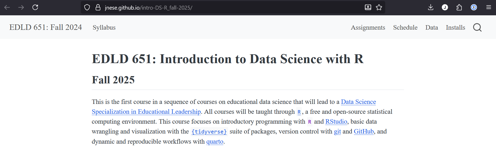
```
:::
::::

## Create a dashboard!

with `{flexdashboard}`!

```{r, out.width='100%'}
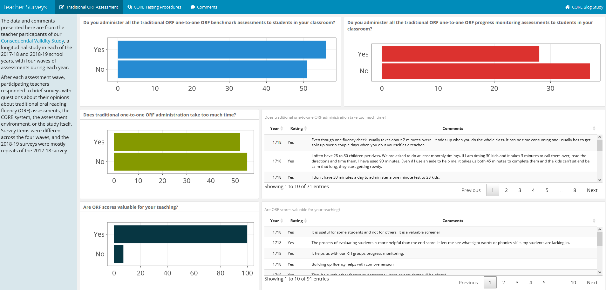
```

## Create an app!

with `{shiny}`!

```{r, out.width='100%'}
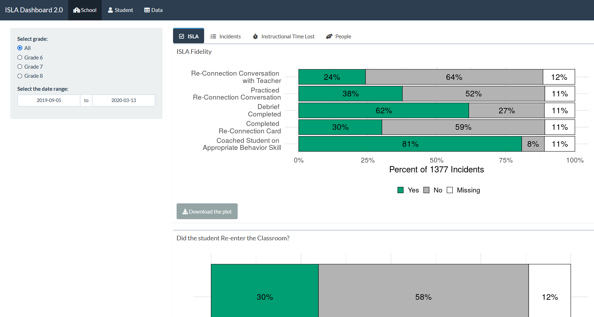
```

## Create a poster!

with `{posterdown}`!

```{r, out.width='100%'}
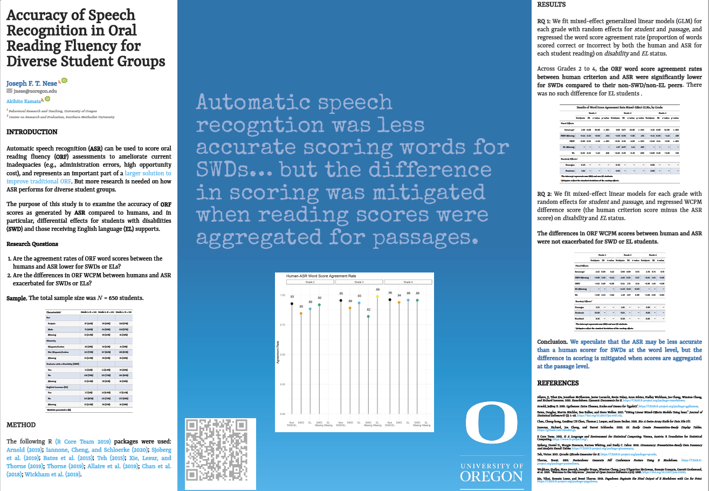
```

## 


## Why is `R` awesome? {.smaller}

. . .

**Data visualizations**

-   `{ggplot2}` -- your default by the end of this class, really powerful
-   `{plotly}` -- interactive data visualizations
-   `{shiny}` --- interactive data communications

. . .

**Web**

-   `{blogdown}`, `{distill}`, `{bookdown}`, `quarto` --- build your own website
-   `{rvest}` --- scrape web data

. . .

**Modeling**

-   `{lme4}` --- multilevel modeling
-   `{lavaan}` --- SEM
-   `{tidymodels}` --- machine learning

. . .

**Workflow!**

-   RStudio projects
-   `{here}`

## Acknowledgements

This course, and much of the materials prepared and content presented, was originally developed by [Daniel Anderson](https://www.linkedin.com/in/danieljanderson/)

-   [Alison Hill](https://www.apreshill.com/), [Chester Ismay](https://chester.rbind.io/), and [Andrew Bray](https://andrewpbray.github.io/) helped Daniel design the content for this course and the specialization as a whole

## What this class is about

Celebrating successes!

. . .

{width="45%"}

## Dr. Richard Feynman

American theoretical physicist, Nobel Laureate

. . .

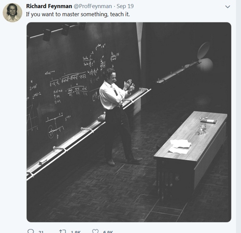

## Sharing

Sometimes I may ask people to share with the class something they have learned.

-   A success, a new `{package}` or `function()`
-   *Completely* voluntary
    -   **BUT**, you might get a hex sticker 🎉

. . .


## A sharing example

:::: {.columns}
::: {.column width="50%"}
> "I made this cool figure!
>
> I used the `{gghighlight}` package for the first time!
>
> And I annoted my facets separately!"
:::

::: {.column width="50%"}
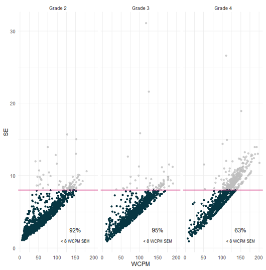
:::
::::

## Another sharing example

:::: {.columns}
::: {.column width="50%"}
> "I went to re-run my 'cool figure' a couple months later and my code did not work!
>
> I spent \[*mumble mumble*\] hours getting it to work again!"
:::

::: {.column width="50%"}

:::
::::

## What this class is about

Celebrating failures!

. . .

{width="80%"}

## What does Richard Feynman have to say about failing?

. . .

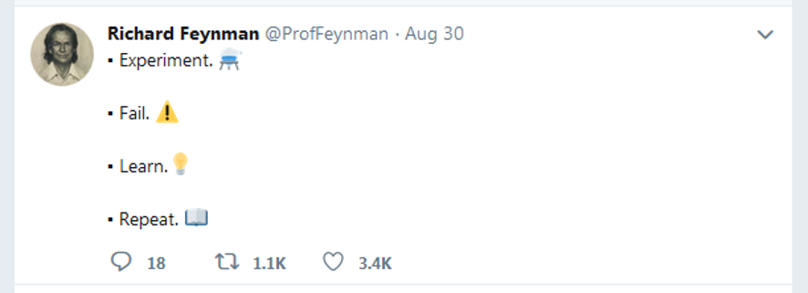

## What this class is about

Celebrating trying!

. . .

{width="60%"}

## Very smart person Richard Feynman said:

. . .


## What this class is about

Learning to problem solve!

. . .

{width="65%"}

## Richard?

. . .


# This class... {.smaller}

**...is**

-   data visualization
-   data structuring and manipulations
-   reproducible workflows
-   a LOT (content and assignments at a fast pace)

. . .

**...is not**

-   all encompassing
-   a statistics course
    -   but we'll use some stats in examples

# Syllabus

## Course Learning Outcomes {.smaller}

-   Understand the `R` package ecosystem
    -   how to find, install, load, and learn about them
-   Read "flat" (i.e., rectangular) datasets into `R`
-   Perform basic data manipulations / transformations in `R` with the `{tidyverse}`
    -   leverage appropriate functions for introductory data science tasks
    -   prepare data using scripts and reproducible workflows
-   Use version control with `R` via `git` and `GitHub`
-   Use `Quarto` to create reproducible dynamic reports
-   Understand and create different types of data visualizations

## Course Site {.smaller}

[**https://jnese.github.io/intro-DS-R_fall-2025/**](https://jnese.github.io/intro-DS-R_fall-2025/)

- [schedule](https://jnese.github.io/intro-DS-R_fall-2025/schedule.html)
- [slides](https://jnese.github.io/intro-DS-R_fall-2025/schedule.html) (posted *before* each class)
- [assignments](https://jnese.github.io/intro-DS-R_fall-2025/assignments.html) (posted *after* each class)
- [syllabus](https://jnese.github.io/intro-DS-R_fall-2025/syllabus.html)
- [data](https://jnese.github.io/intro-DS-R_fall-2025/data_list.html)

**Canvas**

-   submit assignments
-   course announcements

## Required Textbooks (free)


## Codecademy

-   Supplemental learning opportunities that I hope are helpful
-   Part of your "Supplemental Learning" grade

## Resources {.smaller}

-   [UO Libraries Data Services](https://library.uoregon.edu/department-of-open-research/data-service)
    -   cover statistical software (like `R` and `Python`), statistics, research design, GIS, git/GitHub
-   [learnR4free](https://www.learnr4free.com/en/index.html)
    -   all sorts of resources (books, videos, websites, papers) to learn `R` for free
-   [R-Ladies](https://rladies.org/)
    -   Global organization to promote gender diversity in the R community
-   [Posit Community](https://forum.posit.co/)
    -   Similar to [stackoverflow](https://stackoverflow.com/questions/tagged/r) but friendlier (great place to post questions)
    -   Opinionated
    -   Posit-philosophy dominant (as is this class)

## Weekly Schedule

-   Readings - do before class
-   Homeworks - due before following class

## Assignements {.smaller}

**Homework (200 points)**

-   Homeworks -- 10 at 13 points each (130 points)
-   Supplemental Learning - 7 at 10 points each (70 points)
    -   Codeacademy $\times$ 7
    -   Screenshot of specific part of "Supplemental Learning"

**Final Project (200 points)**

-   Outline (15 points)
-   Draft Data Prep Script (25 points)
-   Peer Review of Draft Data Prep Script (25 points)
-   Final Project Presentation (25 points)
-   Final Paper (110 points)

**400 points total**

## Grading

```{r}
#| echo: false
#| fig-width: 5

read_csv(here("rubrics", "grades_rubric.csv")) |> 
  mutate(across(everything(), ~ifelse(is.na(.), "", .))) |> 
  kable(caption = "<b>Grading Components</b>") |> 
  kable_classic(full_width = TRUE) |> 
  kable_styling(font_size = 14, position = "left")

```

## Homework {.smaller}

-   Scored on a "best honest effort" basis
    -   generally zero or full credit
-   If you find yourself stuck and unable to proceed, **please contact the instructor for help rather than submitting incomplete work**
    -   Contacting the instructor is part of the "best honest effort" and can result in full credit for an assignment even if the work is not fully complete
-   **If the assignment is not complete, and the student has not contacted the instructor for help, it is likely to result is a partial credit score or a zero**
-   Homeworks are generally due the class after they are assigned, before class starts
    - You **can** work in groups on these
    - late: 7 points max
    - \>1 week late: 0 points

## Final Project {.smaller}

-   Group project, 3-4 people
    + You select or me organize? (*vote*)
    + The expectations if you select
-   Quarto document

**Final project must:**

-   Be fully reproducible
    -   this implies the data are open
-   Be a collaborative project hosted on GitHub
-   Move data from its raw "messy" format to a tidy data format
-   Include at least two exploratory plots
-   Include at least summary statistics of the data in tables, although fitted models are also encouraged

## Final Project - Dates

-   **Week 3 (10/15)**: Self-selected groups finalized
-   **Week 5 (10/29)**: Final Project Outline due
-   **Week 9 (11/26)**: Data prep script due
-   **Week 10 (12/3)**: Peer review due
-   **Week 10 (12/3)**: Final project presentations
-   **Week 11 (12/10)**: Final Paper due

## Final Project - Paper Scoring Rubric

```{r}
#| echo: false
#| fig-height: 4

read_csv(here("rubrics", "final-project_rubric.csv")) |> 
  mutate(`Points Possible` = ifelse(is.na(`Points Possible`), "", `Points Possible`)) |>
  gt() |> 
  fmt_markdown(columns = everything()) |>
  tab_style(
    style = list(
      cell_text(weight = "bold")
      ),
    locations = cells_body(
      columns = everything(),
      rows = c(1, 8, 12, 20)
    )
  ) |>
    tab_style(
    style = list(
      cell_fill(color = "white")),
    locations = cells_body(
      columns = c(1, 2))
  ) |> 
  tab_options(column_labels.background.color = "#0072B2",
              table.font.size = px(10),
              container.height = pct(80))
```

## Final Project - Outline

**Primary purpose:** Get feedback and give me a preview of your project

-   Description of the data to be used
-   Discussion of preparatory work that needs to be done
-   How the requirements of the final project will be met
-   Anything you want feedback on

## Final Project - Data Prep Script

-   Expected to be a work in progress
-   Provided to your peers so they can learn from you as much as you can learn from their feedback

**Peer Review**

-   Understand the purpose of the exercise
-   Conducted as a professional product
-   Should be **very** encouraging
-   Zero tolerance policy for inappropriate comments

## Final Project - Presentation

**Order randomly assigned. Should cover the following:**

-   Share your journey (everyone, at least for a minute or two)
-   Discuss challenges you had along the way
-   Celebrate your successes
-   Discuss challenges you are still facing
-   Discuss substantive findings
-   Show off your cool figures!
-   Discuss next `R` hurdle you want to address

## Final Project -- Presentation Scoring Rubric

```{r}
#| echo: false
#| fig-width: 6

read_csv(here("rubrics", "final-presentation_rubric.csv")) |> 
  mutate(across(everything(), ~ifelse(is.na(.), "", .))) |> 
  kable(caption = "<b>Final Presentation Rubric</b>") |> 
  kable_classic(full_width = TRUE) |>
  row_spec(6, bold = TRUE) |> 
  kable_styling(font_size = 14, position = "left")
```

## Final Projct - Paper {.smaller}

-   Research Paper
    -   Abstract, Intro, Methods, Results, Discussion, References
    -   Should be brief: 3,500 words max
-   No code displayed - should look like any other manuscript being submitted for publication
-   Include at least 1 table
-   Include at least 2 plots
-   Should be fully open, reproducible, and housed on GitHub
    -   I should be able to clone your repository, open the RStudio Project, and reproduce the full manuscript (by rendering the Quarto doc)

## git and GitHub {.smaller}

-   Will be required for final project
-   What is it?
    -   Version control system
    -   Collaboration tool
    -   Can be powerful for transparency and reproducibility
    -   More to come
-   Think of a GitHub profile as a public resume and treat it as such
-   [Username advice](https://happygitwithr.com/github-acct.html) from Jenny Bryan

. . .

Git might be frustrating, but we'll get through it together!

# Welcome to `R` !

## What is `R` {.smaller}

-   `R` is an environment and programming language, created primarily for statistical analyses and graphics
-   No point-and-click interface
-   Open source
    -   source code is freely available, and can be redistributed and modified
-   Incredibly powerful and flexible
    -   Vast array of external packages available for specialized functions (analyses, data visualizations, automate the data "cleaning" process)

## 

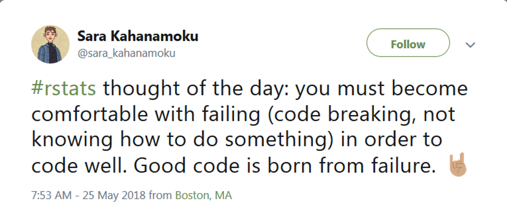

## 

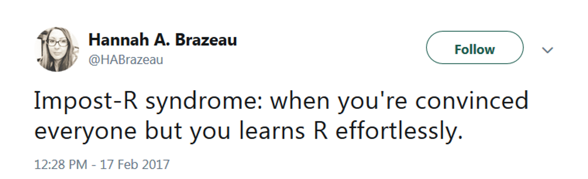

## 

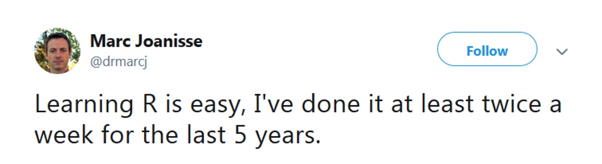

## 

> The bad news is that whenever you learn a new skill you're going to suck. It's going to be frustrating. The good news is that is typical and happens to everyone and it is only temporary. You can't go from knowing nothing to becoming an expert without going through a period of great frustration and great suckiness.

-- Hadley Wickham

## Moving to code/programming {.smaller}

:::: {.columns}
::: {.column width="50%"}
**Advantages**

* Flexibility 
    + Essentially anything is possible
* Transparency 
    + Documented history of your analysis 
* Efficiency 
    + Many tasks can be automated
    
:::

::: {.column width="50%"}
**Disadvantages**

-   Steep learning curve
    -   Definitely requires a significant time investment
    -   Similar to learning a new language
-   You will lose patience with point-and-click interfaces
-   Likely to become "one of the converted"

:::
::::

## Code-based Interface

This is the `R` console

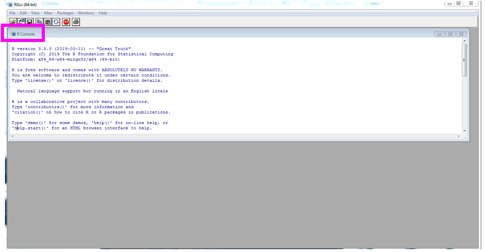

## Code-based Interface

This is the RStudio IDE *(Integrated Development Environment)*

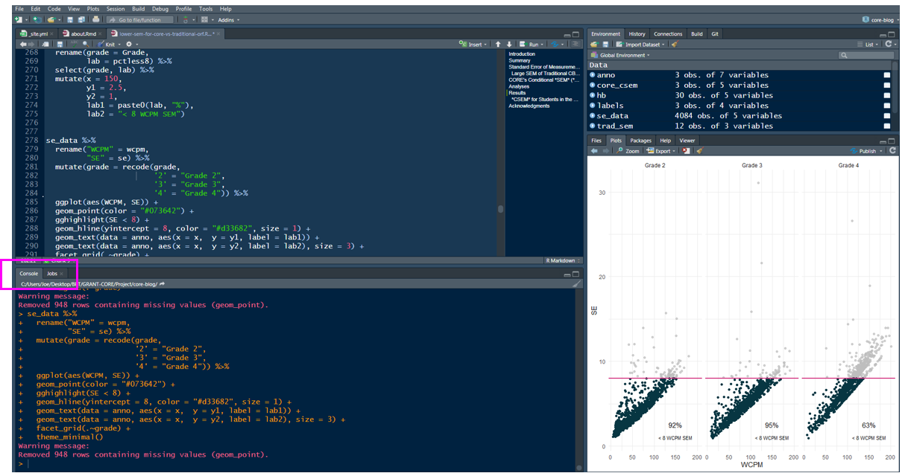

## How to learn `R`?

-   Time
-   Use it!
-   Dedication and determination help
-   Be patient and forgiving with yourself, it will feel slow at first
-   I still get frustrated

## `R` as a big calculator

```{r}
#| echo: true
3 + 2
```

. . .

```{r}
#| echo: true
3 / (3+2)
```

. . .

```{r}
#| echo: true
sqrt(49)
```

## Object Assignment `<-` {.smaller}

Objects are stored in active memory of your computer with names that you provide

. . .

`<-` is the assignment operator

. . .

It is used to assign names to objects (like an `=` operator)

. . .

```{r, echo=TRUE}
a <- 3
b <- 2
a
```

. . .

```{r, echo=TRUE}
a + b
```

. . .

```{r, echo=TRUE}
a / (a + b)
```

## Re-assignment

```{r}
#| echo: true
a
```

. . .

```{r}
#| echo: true
a <- 10
a
```

. . .

```{r}
#| echo: true
a <- "EDLD 651"
a
```

## Data Types {.smaller}

Data can be a variety of types

. . .

-   **character**: `"Hello world!"` or `"EDLD 651"`

. . .

-   **numeric**: `2` and/or `15.5` 
    - whole number called an **integer**
    - decimal called a **double**
    - *Aside*: explicit about an integer `2L` (the `L` tells `R` to store this as an integer) ¯\\_(ツ)_/¯

. . .

-   **logical**: `TRUE` or `FALSE`

. . .

These data types can be extremely useful in programming

## Objects {.smaller}

:::: {.columns}
::: {.column width="50%"}
Objects can also be:

-   variables
-   data sets
-   models
-   results
-   functions
-   figures
-   more...
:::

::: {.column width="50%" .fragment}
You can then use or manipulate these in different ways

-   plots
-   functions
-   operators (arithmetic, logical, comparison)

:::
::::

## `R` Functions {.smaller}

Anything that carries out an operation in `R` is a function, even `+`

Functions are generally followed by `()`

-   **`function_name()`**

    -   `sum()`
    -   `lm()`
    -   `sqrt()`

. . .

**`function_name()` == `package_name::function_name()`**

the package is also called the "namespace"

## Getting help

`?` before a function name can be very helpful (and also confusing early on)

. . .

-   Helpful for understanding formal *arguments* of a function
    -   *arguments* are options within a `function()`

. . .

`?function_name()`

```{r}
#| eval: false
#| echo: true
?mutate() #mutate() is a function in the {dplyr} package

?dplyr::mutate()
```

. . .

```{r}
#| eval: false
#| echo: true

?mean
```


## 

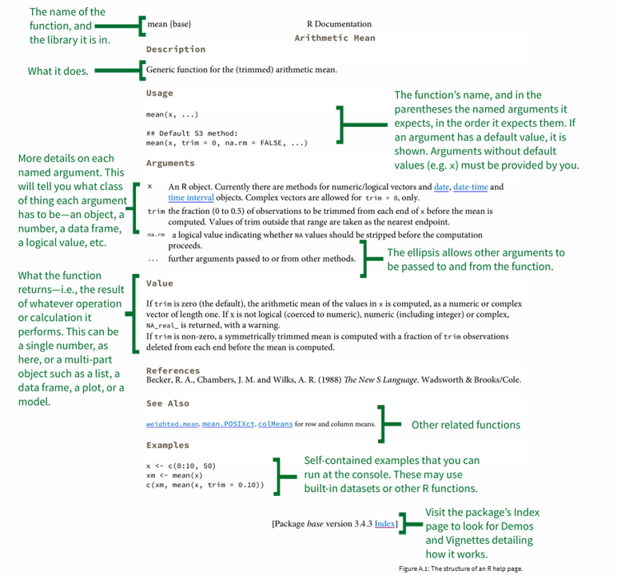 

::: aside 
[Healy (2018)](https://socviz.co/ )
:::

## Getting help

-   Resources on syllabus
-   Your classmates!
-   Me
    -   Appointment by email
    -   If you email me with a question, provide your `R` files & data
-   Google
    -   stackoverflow
    
## Getting help

Generative AI (e.g., ChatGPT)


## Back to Dr. Feynman

(Isaac Asimov, really)

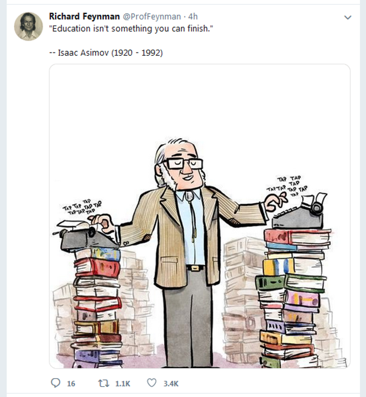

# Installs

## Install Check {.smaller}

[Installs](https://jnese.github.io/intro-DS-R_fall-2025/installs.html)

-   [R](https://cloud.r-project.org/)
-   [Rstudio](https://www.rstudio.com/products/rstudio/#Desktop)
-   [Git](https://www.git-scm.com/download)
-   [GitKraken](https://www.gitkraken.com/download)

Also

* [Register for GitHub account](https://github.com) 
    + username [advice](https://happygitwithr.com/github-acct.html) from Jenny Bryan

# Customize!

## Mandatory: Customize your RStudio {.smaller}

:::: {.columns}
::: {.column width="60%"}

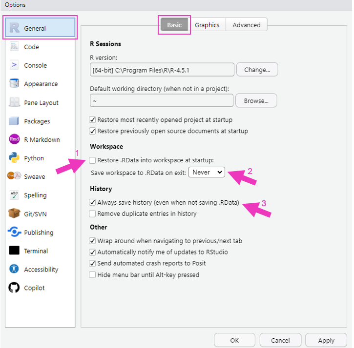

:::

::: {.column width="40%"}
**Tools > Global Options > General > Basic**

-   **Workspace**
    -   *Restore .RData into workspace at startup* -- _**Uncheck**_
    -   *Save workspace to .RData on exit:* -- _**Never**_
-   **History**
    -   *Always save history (even when not saving .RData)* -- _**Check**_

:::
::::

## Optional: Customize your RStudio {.smaller}

:::: {.columns}
::: {.column width="60%"}

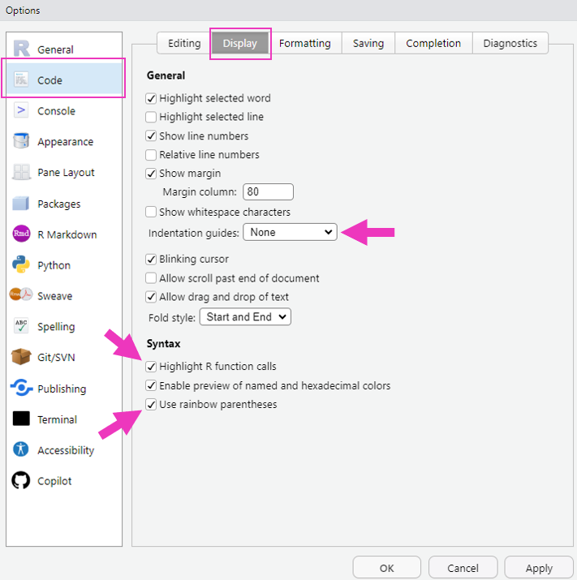

:::

::: {.column width="40%"}

**Tools > Global Options > Code > Display** 

- **General**
    + *Show indent guides* -- I don't like it, up to you

- **Syntax**
    + *Highlight R function calls* -- I like it, up to you
    + *Enable preview of named and hexadecimal colors* -- I like it, up to you
    + *Use rainbow parentheses* -- I like it, up to you

:::
::::

## Optional: Customize your RStudio {.smaller}

:::: {.columns}
::: {.column width="60%"}

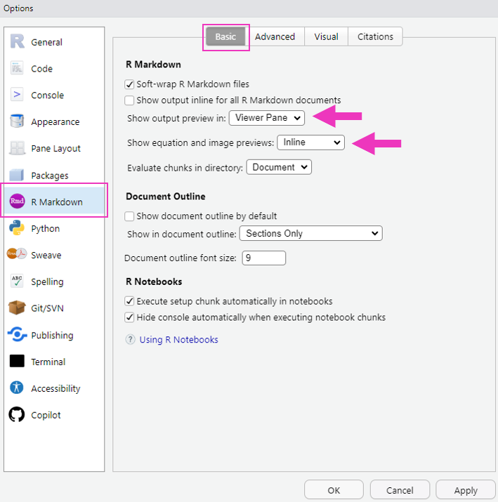

:::

::: {.column width="40%"}

**Tools > Global Options > R Markdown > Basic**

- **R Markdown**
    + *Show output preview in:* -- _**Viewer Pane**_
    + *Show equation and image previews:* -- _**Inline**_

:::
::::


## Optional: Customize your RStudio Display!

:::: {.columns}
::: {.column width="60%"}

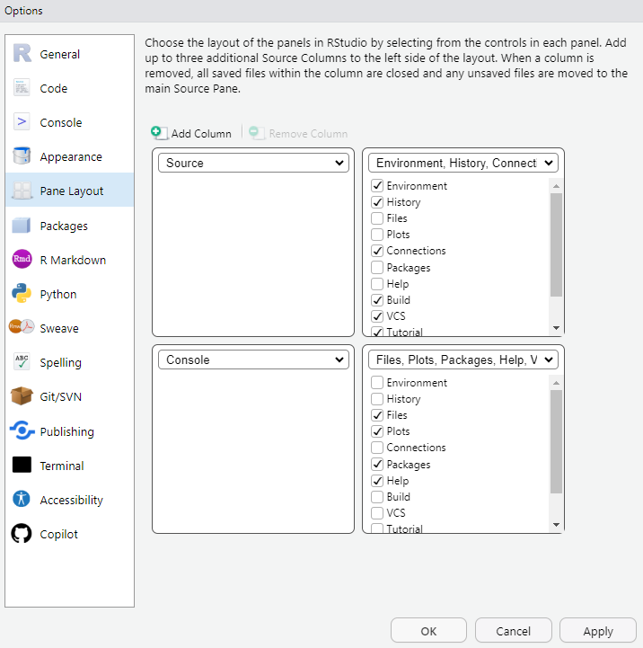

:::

::: {.column width="40%"}

__Tools > Global Options > Pane Layout__

As you like!


:::
::::


## Customize your RStudio Display!

__Tools > Global Options > Appearance__

(let's take a look)

**Editor font**

**Editor font size**

**Editor theme!!** 🎉

## Keyboard Shortcuts {.smaller}

There are a lot...

**Tools > Keyboard Shortcuts Help** (`Alt + Shift + K`)

**Tools > Modify Keyboard Shortcuts**

::: {.fragment}

My favorites (for Macs, sub `Command` for `Ctrl`)

1.  `Ctrl + Enter` = run code
2.  `Ctrl + Shift + M` = insert pipe (`|>`)
3.  `Ctrl + Alt + I` = insert code chunk in R Markdown
4.  `Ctrl + Shift + C` = comment a block
:::

::: {.fragment}

Other good ones

-   `Alt + -` = insert assignment operator (\<-)
-   `Alt + Shift + Up/Down` = add cursor above/below current cursor

[**demo**]{style="color:#D55E00;"}

:::

# `R` Packages

## The data science pipeline


::: aside
[R4DS(2e)](https://r4ds.hadley.nz/diagrams/data-science/base.png)
:::

. . .

#### How do we go about this?

## "Out of the box" functionality {.smaller}

`R` packages provide functions (and datasets) for you to use

. . .

Some packages are pre-loaded: no need to load (`library(base)`), you can use all of their functions anytime

-   `{base}`
-   `{graphics}`
-   `{stats}`

. . .

Some packages are pre-installed: you just need to load the package (`library(MASS)`) or use the namespace (`MASS::cats`)

-   `{boot}`
-   `{MASS}`
-   `{Matrix}`

## Pre-loaded vs Installed

Pre-loaded packages work on launch

For example, `plot()` is part of the `{graphics}` package, which ships with `R` . . .

```{r}
#| echo: true
#| fig-height: 5
plot(x = 1:10, y = 1:10)
```

## `{base}` package

-   All functions come from a package

. . .

-   What do you get with the following?

`?'+'`

## 

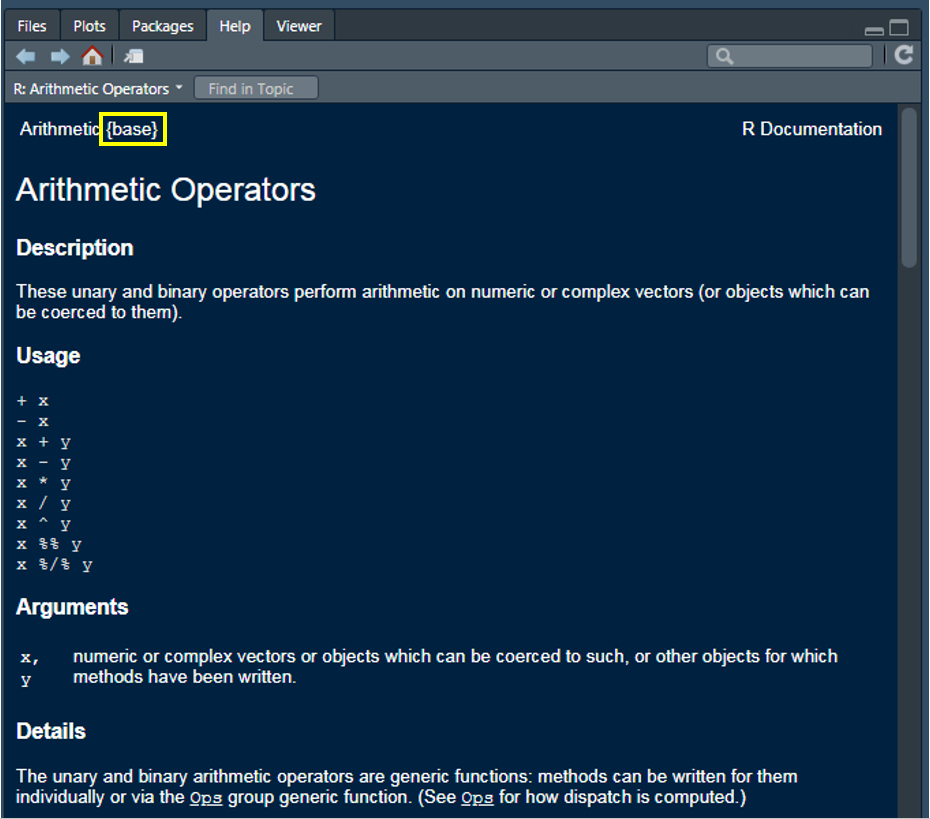

## Packages on CRAN {.smaller}

There is a TON of functionality that comes with R right from your initial download **BUT** the functionality can be extended by installing other packages

. . .

CRAN is the official repository 

* a network of servers maintained by the R community around the world
* coordinated by the [R Foundation](https://www.r-project.org/foundation/)
* a package needs to pass several tests to be published on CRAN

. . .

Most often, you will first install a package, then load it

* `install.packages(“package_name”)`
* `library(package_name)`

. . .

You will only need to install a package **once** (generally). After that, it is in your library and only needs to be loaded

## One more time {.smaller}

. . .

`install.packages(“package_name”)`

. . .

-   you will only need to do this the **FIRST** time you use the package
-   don't keep this code line (just run it in the console!)
-   notices the quotes around the package name

. . .

`library(package_name)`

. . .

-   you will do this **every** time you use the package in your scripts
-   notices no quotes

## OK, last time {.smaller}

. . .

`install.packages(“package_name”)`

. . .

one time!

. . .

`library(package_name)`

. . .

every time!

## Other packages

On GitHub

-   Popular repository for open source projects
    -   Integrated with git (version control)
    -   Easy to share/collaborate
-   Not necessarily `R` specific
-   Generally, these packages "in development," or are the beta versions of existing packages
-   No review process associated with GitHub

## Possibilities {.smaller}

With just a basic knowledge of `R` you have access to thousands of packages

-   Expanding on a daily basis
    + Currently, the CRAN package repository features 22,676 packages 
    + 21,000+ last year at this time
    + constantly evolving to keep up with the varied demands of the data science community
-   Provides access to cutting edge and specialized functionality for analysis, data visualization, and data preparation
-   Some of the most modern thinking on data analysis topics are often represented in these packages

# Let's dive in

(or end here for today)

## How do we access variables (columns) in our data?

-   Generally, in this course, with `{tidyverse}` tools

. . .

-   Sometimes with `base` using `$` or with `[]`
    -   `data_name$variable_name`
    -   `data_name["variable_name"]`

## Some data {.smaller}

Let's load the `{tidyverse}`, and then we'll access some variables from the data sets within the packages

Then let's take a `glimpse` at the `gss_cat` data which loads with `tidyverse`

. . .

```{r}
#| echo: true
#| eval: false

# install.packages(“tidyverse”) 
## if you have never installed {tidyverse} you'll need to do that first
library(tidyverse)

glimpse(gss_cat)
```

. . .

```{r}
#| echo: true

# install.packages(“tidyverse”) 
## if you have never installed {tidyverse} you'll need to do that first
library(tidyverse)

glimpse(gss_cat)
```

## Selecting varaibles

Select the `marital` variable with `$`

. . .

```{r}
#| echo: true
#| eval: false

gss_cat$marital
```

. . .

```{r}
#| echo: false
gss_cat$marital
```


## Look at the `str`ucture of an object

```{r}
#| echo: true
#| eval: false
str(gss_cat)
```

. . .

```{r}
#| echo: false
str(gss_cat)
```

. . .

```{r}
#| echo: true
#| eval: false
str(gss_cat$marital)
```

. . .

```{r}
#| echo: false
str(gss_cat$marital)
```

## Because `gss_cat` is a `tibble`

```{r}
#| echo: true
#| eval: false
gss_cat
```

. . .

```{r}
#| echo: false
gss_cat
```

## When to use `$`?

-   Often when you need to use `{base} R`
-   Execute a function casually

. . .

```{r}
#| echo: true
table(gss_cat$marital)
```

. . .

```{r}
#| echo: true
hist(gss_cat$age)
```

## Your turn

Run `table()` on the *religion* variable in `gss_cat`

Produce a `hist`ogram of the *tvhours* variable in `gss_cat`

## The pipe operator (`|>`)

-   The `|>` operator (`Ctrl + Shift + M`) inserts the input from the left as the first argument in the next function
-   To start, you can read it as, "then"
-   It is crucial for work in the `{tidyverse}`

## The pipe operator (`|>`)

*Note*

You may see me use `%>%` instead of `|>`
- this is only because old habits die hard
- they are (almost always) interchangeable 

. . .

```{r}
#| echo: true
gss_cat |> 
  count(marital)
```

. . .

We will talk about this a little right now and lot more later

## Quick aside {.smaller}

Base `R` has a native pipe now!

R 4.1.0 introduced a native pipe operator, `|>`. As described in the R News:

> R now provides a simple native forward pipe syntax `|>`. The simple form of the forward pipe inserts the left-hand side as the first argument in the right-hand side call. 

The behavior of the native pipe is basically the same as the `%>%` pipe  (from the `{magrittr}` package)

Luckily there’s no need to commit entirely to one pipe or the other

- you can use `|>` for the majority of cases and use `%>%` when you really need its special features

More [here](https://www.tidyverse.org/blog/2023/04/base-vs-magrittr-pipe/#-vs).

## Why use `|>`

Chaining functions is **efficient** and **easy to read**

. . .

```{r}
#| echo: true

gss_cat |> 
  filter(relig == "Buddhism",
         age > 55) |> 
  select(age, partyid, rincome) |> 
  arrange(age) |> 
  slice(1:4)
```

. . .

**Equivalent to:**

```{r}
#| echo: true
#| eval: false

slice(arrange(select(filter(gss_cat, relig == "Buddhism", age > 55), age, partyid, rincome), age), 1:5)
```

# Next time

## Before next class {.smaller}

- Reading
    + [Week 1 reading](https://jnese.github.io/intro-DS-R_fall-2025/#week-1-introduction)
        - [R4DS(2e) Ch. 5](https://r4ds.hadley.nz/workflow-style)
        - [R4DS(2e) Ch. 3](https://r4ds.hadley.nz/workflow-basics)
        - [R4DS(2e) Ch. 7](https://r4ds.hadley.nz/workflow-scripts)

- Assignments
    + [Installs](https://jnese.github.io/intro-DS-R_fall-2025/install.qmd)
    + [A Quick Tour of the RStudio IDE](http://milton-the-cat.rocks/learnr/r/r_getting_started/#section-a-quick-tour-of-r-studio)
    + [Codecademy: Introduction to R Syntax](https://www.codecademy.com/courses/learn-r/lessons/introduction-to-r/exercises/why-r)
